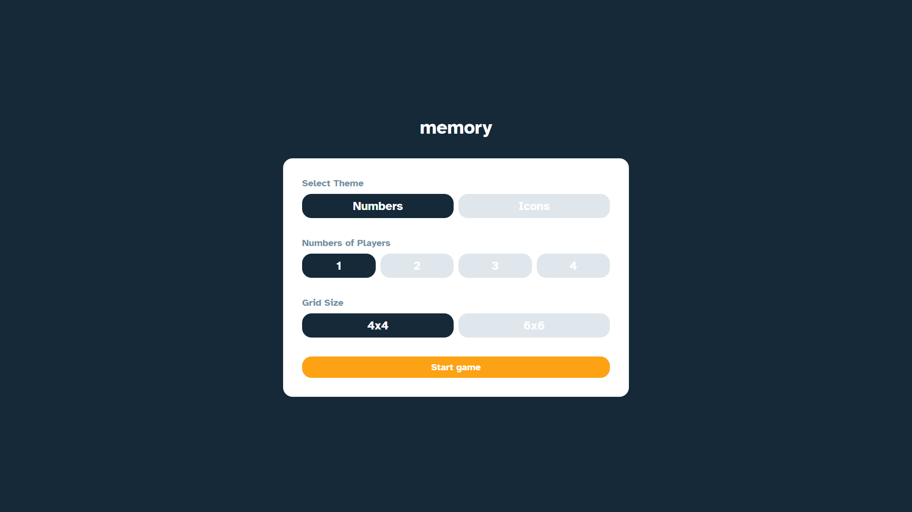
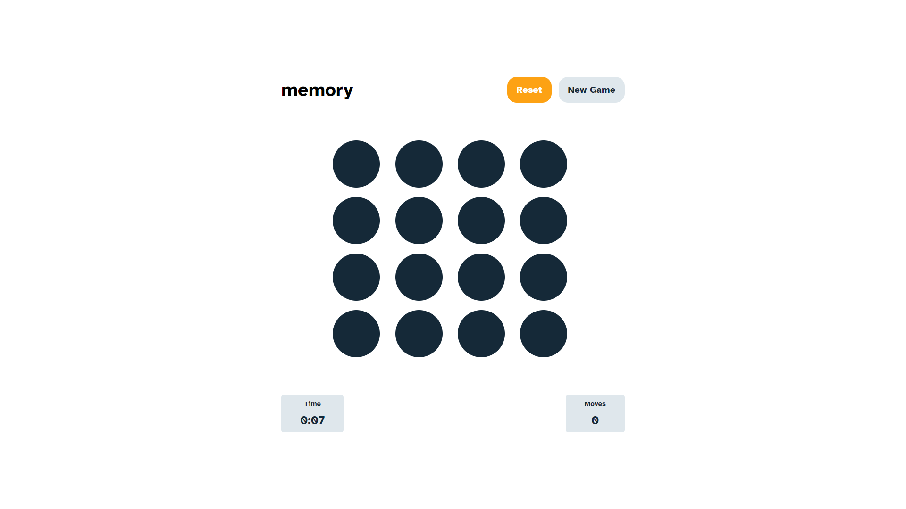
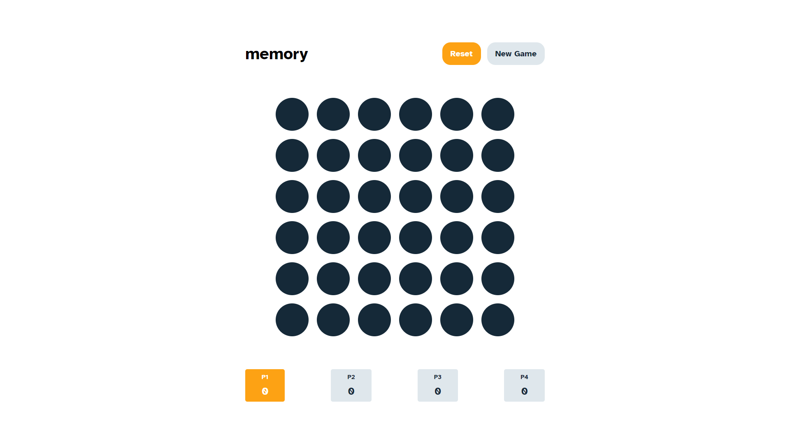

# Memory Game
Memory Game is entertaining game which trains your memory skills. Game provides two different card styles: numbers and icons. User can play singleplayer mode or multiplayer up to 4 players on board. Application keeps track of users points and time and shows ranking table at the end.

# Screenshots preview 

 

 

# Tech Stack
+ React
+ Typescript
+ SCSS
+ React Context

# Installation
To install app localy on your computer you need to clone project from github\
`git clone https://github.com/filipknias/memory-game-react.git`

Then install all dependencies and run app\
`npm install && npm start`

# Live Preview
You can try this game here: https://memory-game-bf58af.netlify.app